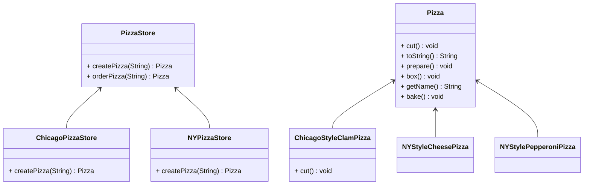

# 팩토리 패턴

## 팩토리 메서드 패턴
- 클래스의 인스턴스를 만드는 일을 서브클래스에 맡김

## uml 로 팩토리 메서드 패턴 파악

```mermaid
classDiagram
direction BT
class ChicagoPizzaStore {
  + createPizza(String) Pizza
}
class ChicagoStyleClamPizza {
  + cut() void
}
class NYPizzaStore {
  + createPizza(String) Pizza
}
class NYStyleCheesePizza
class NYStylePepperoniPizza
class Pizza {
  + cut() void
  + toString() String
  + prepare() void
  + box() void
  + getName() String
  + bake() void
}
class PizzaStore {
  + createPizza(String) Pizza
  + orderPizza(String) Pizza
}

ChicagoPizzaStore  -->  PizzaStore 
ChicagoStyleClamPizza  -->  Pizza 
NYPizzaStore  -->  PizzaStore 
NYStyleCheesePizza  -->  Pizza 
NYStylePepperoniPizza  -->  Pizza 

```