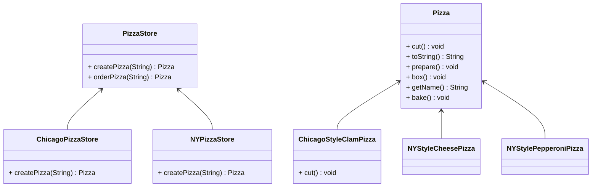

# 팩토리 패턴

## 팩토리 메서드 패턴
- 클래스의 인스턴스를 만드는 일을 서브클래스에 맡김

## uml 로 팩토리 메서드 패턴 파악

```mermaid
classDiagram
direction BT
class ChicagoPizzaStore {
  + createPizza(String) Pizza
}
class ChicagoStyleClamPizza {
  + cut() void
}
class NYPizzaStore {
  + createPizza(String) Pizza
}
class NYStyleCheesePizza
class NYStylePepperoniPizza
class Pizza {
  + cut() void
  + toString() String
  + prepare() void
  + box() void
  + getName() String
  + bake() void
}
class PizzaStore {
  + createPizza(String) Pizza
  + orderPizza(String) Pizza
}

ChicagoPizzaStore  -->  PizzaStore 
ChicagoStyleClamPizza  -->  Pizza 
NYPizzaStore  -->  PizzaStore 
NYStyleCheesePizza  -->  Pizza 
NYStylePepperoniPizza  -->  Pizza 

```

## 추상 팩토리 패턴

- 인터페이스를 사용하여 의존하는 객체를 구상 클래스를 지정하지 않고 생성
  - 서브클래스에서 방식이 정의 됨

```mermaid
classDiagram
direction BT
class BlackOlives {
  + toString() String
}
class Cheese {
<<Interface>>
  + toString() String
}
class CheesePizza {
  + prepare() void
}
class ChicagoPizzaIngredientFactory {
  + createPepperoni() Pepperoni
  + createClam() Clams
  + createSauce() Sauce
  + createCheese() Cheese
  + createVeggies() Veggies[]
  + createDough() Dough
}
class ChicagoPizzaStore {
  + createPizza(String) Pizza
}
class ClamPizza {
  + prepare() void
}
class Clams {
<<Interface>>
  + toString() String
}
class Dough {
<<Interface>>
  + toString() String
}
class Eggplant {
  + toString() String
}
class FreshClams {
  + toString() String
}
class FrozenClams {
  + toString() String
}
class Garlic {
  + toString() String
}
class MarinaraSauce {
  + toString() String
}
class MozzarellaCheese {
  + toString() String
}
class Mushroom {
  + toString() String
}
class NYPizzaIngredientFactory {
  + createDough() Dough
  + createClam() Clams
  + createCheese() Cheese
  + createVeggies() Veggies[]
  + createPepperoni() Pepperoni
  + createSauce() Sauce
}
class NYPizzaStore {
  + createPizza(String) Pizza
}
class Onion {
  + toString() String
}
class ParmesanCheese {
  + toString() String
}
class Pepperoni {
<<Interface>>
  + toString() String
}
class PepperoniPizza {
  + prepare() void
}
class Pizza {
  + box() void
  + getName() String
  + bake() void
  + setName(String) void
  + prepare() void
  + toString() String
  + cut() void
}
class PizzaIngredientFactory {
<<Interface>>
  + createCheese() Cheese
  + createDough() Dough
  + createSauce() Sauce
  + createVeggies() Veggies[]
  + createClam() Clams
  + createPepperoni() Pepperoni
}
class PizzaStore {
  + createPizza(String) Pizza
  + orderPizza(String) Pizza
}
class PizzaTestDrive {
  + main(String[]) void
}
class PlumTomatoSauce {
  + toString() String
}
class RedPepper {
  + toString() String
}
class ReggianoCheese {
  + toString() String
}
class Sauce {
<<Interface>>
  + toString() String
}
class SlicedPepperoni {
  + toString() String
}
class Spinach {
  + toString() String
}
class ThickCrustDough {
  + toString() String
}
class ThinCrustDough {
  + toString() String
}
class VeggiePizza {
  + prepare() void
}
class Veggies {
<<Interface>>
  + toString() String
}

BlackOlives  ..>  Veggies 
CheesePizza  -->  Pizza 
ChicagoPizzaIngredientFactory  ..>  PizzaIngredientFactory 
ChicagoPizzaStore  -->  PizzaStore 
ClamPizza  -->  Pizza 
Eggplant  ..>  Veggies 
FreshClams  ..>  Clams 
FrozenClams  ..>  Clams 
Garlic  ..>  Veggies 
MarinaraSauce  ..>  Sauce 
MozzarellaCheese  ..>  Cheese 
Mushroom  ..>  Veggies 
NYPizzaIngredientFactory  ..>  PizzaIngredientFactory 
NYPizzaStore  -->  PizzaStore 
Onion  ..>  Veggies 
ParmesanCheese  ..>  Cheese 
PepperoniPizza  -->  Pizza 
PlumTomatoSauce  ..>  Sauce 
RedPepper  ..>  Veggies 
ReggianoCheese  ..>  Cheese 
SlicedPepperoni  ..>  Pepperoni 
Spinach  ..>  Veggies 
ThickCrustDough  ..>  Dough 
ThinCrustDough  ..>  Dough 
VeggiePizza  -->  Pizza 

```